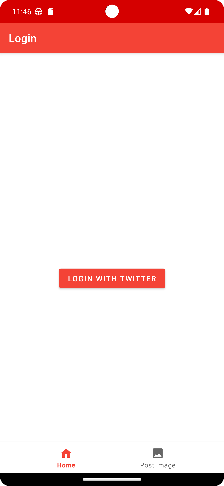
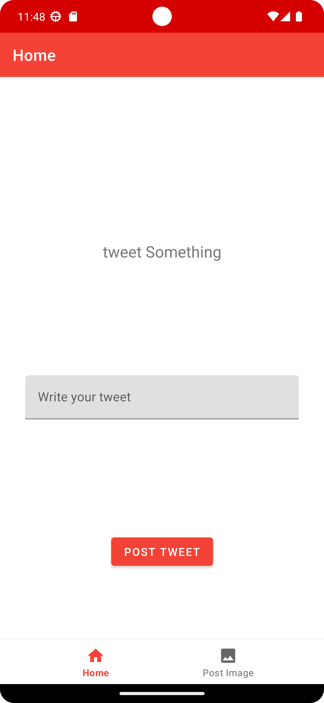
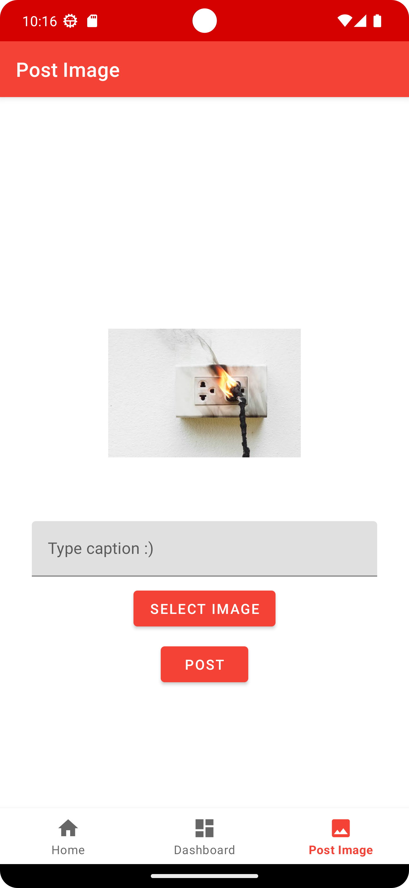

# Tweet from Custom Android app

> Requires you to generate your own consumer keys from Twitter developer portal, and store them local.properties file in the root directory.

> Now users can use the apk in the releases section to login with their twitter accounts.  
> https://github.com/teboho/x/releases/tag/8.10.2023-v0

Cannot be used without consumer keys generated from X/Twitter

## Screenshots

<!--    -->
  

*Login Screen*

<!--    -->
  

*Home screen to post a text tweet*

<!--    -->
  

*Screen to post an image tweet*

---

Again, it cannot be used without consumer keys generated from X/Twitter

## License

```
Teboho License
```