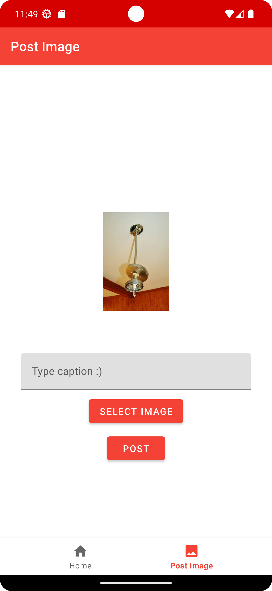

# Tweet from Custom Android app

> Requires you to generate your own keys from Twitter developer portal, and store them local.properties file in the root directory.

Cannot be used without keys generated from X/Twitter

## Screenshots

<!--    -->
  

*Home screen to post a text tweet*

<!--    -->
  

*Screen to post an image tweet*

---

Again, it cannot be used without keys generated from X/Twitter

## License

```
Teboho License
```